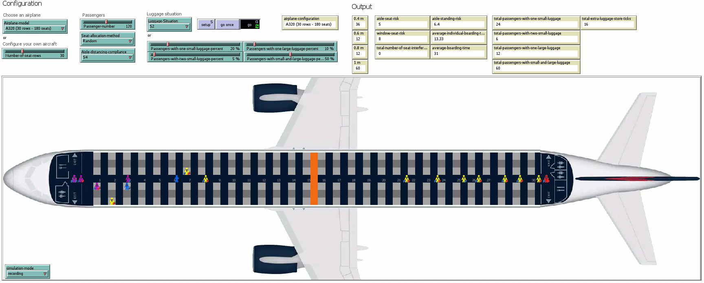
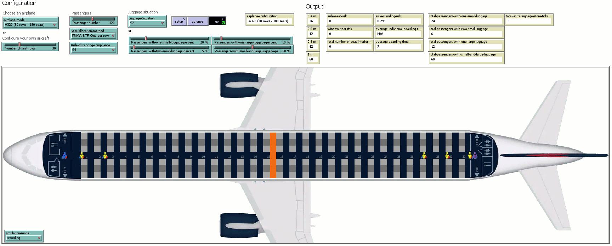

Recordings of the simulations presented in the paper
### **"Health Risks of Airplane Boarding Methods with Apron Buses When Some Passengers Disregard Safe Social Distancing"** 
submitted to the `Reliability Engineering & System Safety` journal.

Please feel free to contact us at liviu.cotfas at ase .ro for further details. 

## Boarding Scenarios

All the simulations have been performed using the following settings:
- occupancy level: all seats are occupied (180 passengers);
- compliance scenario: S4 (described in our paper);
- luggage situation: S2 (described in our paper).

> Suggestions: 
> 1. You can download the animations below in order to watch them at a higher resolution.
> 2. Click on the animations to view them at a better resolution or to download them.

### 1. Random

### 2. Back-to-front

### 3. WilMA Back-to-front

### 4. WilMA Spread

### 5. WilMA Back-to-front – one-per-row

### 6. Reverse-pyramid – Steep

### 7. Reverse-pyramid – Spread

